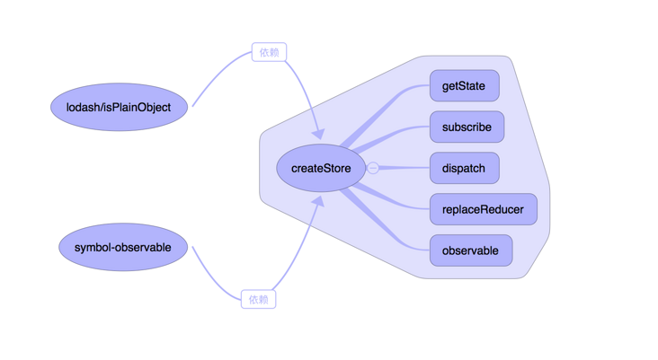

> react-redux

分类：UI 组件、容器组件

应用：
```
import { connect, Dispatch } from 'react-redux'

// connect方法：用于从 UI 组件生成容器组件。connect的意思，就是将这两种组件连起来。
const VisibleTodoList = connect( 
  mapStateToProps,  // 输入逻辑：外部的数据（即state对象）如何转换为 UI 组件的参数
  mapDispatchToProps // 输出逻辑：用户发出的动作如何变为 Action 对象，从 UI 组件传出去。
)(TodoList)

// TodoList是 UI 组件，VisibleTodoList就是由 React-Redux 通过connect方法自动生成的容器组件
```

> createStore 具体做了什么事？源码解读如下



- createStore(reducer, preloadedState, enhancer)。其中,各参数属性如下：

    reducer必需参数，function类型
    preloadedState可选参数，object类型
    enhancer可选参数，function类型

> redux 和 react-redux 区别

import { Provider } from 'react-redux'
import { createStore, applyMiddleware } from 'redux'


> 参考文献

[http://www.ruanyifeng.com/blog/2016/09/redux_tutorial_part_three_react-redux.html](http://www.ruanyifeng.com/blog/2016/09/redux_tutorial_part_three_react-redux.html)
[https://redux.js.org/api/createstore](https://redux.js.org/api/createstore)